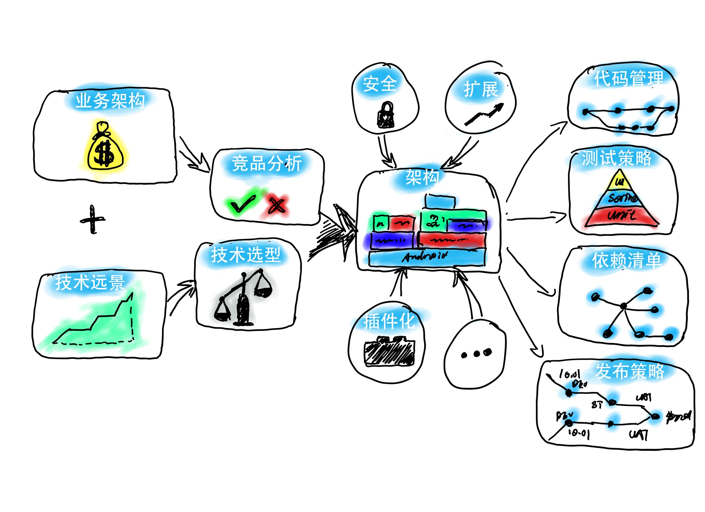
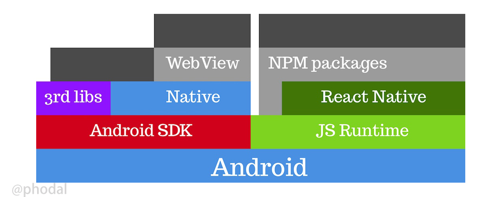
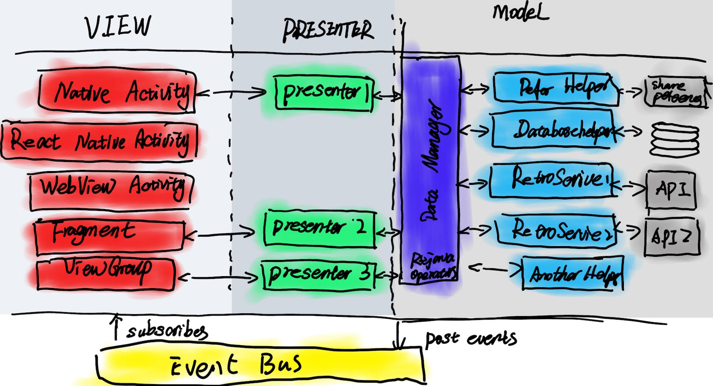

【架构拾集】：一步步设计一个移动应用架构
===

> 如何 GET 架构设计的新技能

在这一个多月里，我工作在一个采用插件化的原生 Android 应用项目上。随着新技术的引入，及编写原生 Android 代码的技能不断提升，我开始思索如何去解锁移动应用新架构。对，我就是在说 Growth 5.0。

两星期前，我尝试使用了 Kotlin + React Native + Dore + WebView 搭建了一个简单的 Android 移动应用模板。为了尝试解决 Growth 3.0+ 出现的一系列问题：启动速度慢、架构复杂等等的问题。

PS：作为 Architecture 练习计划的一部分，我将采用规范一些的叙述方式来展开。

 1. 业务架构
 2. 技术远景
 3. 方案对比
 4. 架构设计方案
 5. 持续集成方案
 6. 测试策略
 7. 架构实施

即下图：



业务架构
---

> 技术是为了解决业务的问题而产生的。

脱离了业务，技术就没有了存在的前提。脱离了业务的架构不叫 “架构”，而叫刷流氓，又或者是画大饼。业务由于其本身拥有其特定的技术场景，往往是对技术决策影响最大的部分。

因此，开始之前让我们先了解一些业务，这里以 Growth 为例。

Growth 的价值定位是：**带你成为顶尖开发者**。

复杂一点的说明就是：_Growth_ **提供** _编程学习服务_ **使用** _Web开发路线_ **帮助** _新手 Web 程序员_ **解决** _Web 学习路径问题_。

让我们来看一下，更复杂一些的说明（电梯演讲）：

 -          |     - 
------------|-----------
对于        | 缺少 Web 体系经验的程序员
他们有      | 书籍、在线教程、论坛、技术问答、练习项目
我们的产品   | 编程学习软件 Growth
是一个      | 移动应用
它可以      | 涵盖Web开发的流程及技术栈，Web开发的学习路线、成长衡量等各方面。
但他不同于  | segmentfault、知乎
它的优势是  | 拥有完整的 Web 开发流程（知识图谱）、配套完整的电子书、提供练习及学习工具。

在原有的业务架构下，我们拥有 Growth、探索、社区、练习四个核心业务，以及用户中心的功能。

 - Growth（首页），即带有详细介绍的 Web 应用的生命周期，能帮助开发者理解 Web 应用的构建流程。
 - 探索，以辅助开发者了解 Web 应用方方面面的知识，如常用工具、练手项目、技能测验、读书路线等等。
 - 练习，通过这些练习项目，来帮助开发者更好的掌握知识。
 - 社区，一个简易的论坛。
 - 用户中心，一些用户的收藏数据、应用相关的设置等等。

这就是业务上的主要架构，接下来让我们看看技术上的事务。

技术远景
---

> 远景，即想象中未来的远大景象。技术远景，即想象中未来的技术方面的远大景象。

在上一节中，我们介绍的是项目的业务远景。而作为一个技术人员，在一个项目里，我们也已经创建自己的技术远景。一来，我们可以创建出可持续演进的架构；二来，可以满足个人的技能需求。

以 Growth 为例，我的最基本的技术需求是：提升自身的能力。然后才是一个跨平台的技术设施——减少构建时间。

从 Growth 1.0、Growth 2.0 采用的 Ionic，到 Growth 3.0 采用的 React Native，它都优先采用新的技术来帮助自己成长，并使用了跨平台的移动应用开发框架。而这几个不同的版本里，也拥有其对应的不同技术问题

 - Growth 1.0 主要是 Angular 1.x 的跳崖式升级，使之变成不可维护的系统。
 - Growth 2.0 则是 Angular 2.x 那庞大的构建体积，带来了启动时间慢的问题。
 - Growth 3.0 则是，React Native 生成的 ``index.android.bundle`` 文件有 3.1M，这个体积相当的大，以至于即使在高通的骁龙 835 处理器上，也需要 4~5 秒的打开时间。

而在 Growth 5.0 的设计构架里，考虑到 React Native 本身的不加密，其对于应用来说，存在一些安全的风险。我决定引入 Native 的计划，来从架构上说明，这个系统在某种程度上也是可以加密的。

因此，对于我而言，从技术上的期望就是：

 - 使用新技术带来成长
 - 让应用长期可维护
 - 拥有跨平台的基础设施
 - 插件化方案

方案对比
---

对于普通的应用来说，其需要**从不同的方案中选择一个合适的方案**。其选择的核心，取决于项目所依赖的关键点。如在 Growth 有两个关键点：代码复用程度、应用性能。

这个时候就需要罗列出不同系统的优缺点，并从中选择合适自己的一部分。

如下数据（**纯属个人使用体验总结，没有任何的数据基础**）：

   -       |   原生   | React Native  | NativeScript  | 混合应用
-----------|----------|--------------|---------------|------------
开发效率    |    2     |    4         |        3      |    5 
跨平台程度  |    0     |    3         |        3      |    4
性能		   |    5     |    4         |   4           |    2
成熟度     |     5     |    4         |   3           |    5 
安全性     |     5     |    3         |   4           |    2 
总计       |    17      |   18        |   17          |  18

PS：NativeScript 在安全性上比 React Native 好一点点的原因是，使用 NativeScript 的人相对少一点，所以技术成本就高一些。毕竟，macOS 和 Android 手机上也是有病毒的。

考虑到我打算结合不同的几个框架，所以这里就不需要选择了。

技术方案
---

在 Growth 3.0 里，我们选择了使用 React Native + WebView 的构建方式，其原因主要是 WebView 的生态圈比较成熟，有相当多的功能已经用 WebView 实现了。而在新版本的设计中，则系统变得稍微复杂一些：



现今的很多应用里，也是采用类似的架构，如淘宝的 Android 原生 + Weex + WebView，或者支付宝（不确定有没有 Weex）。但是，可以肯定的是几乎每个大型应用，都会在应用里嵌入 WebView。WebView 毕竟是可以轻松地进行远程动态更新，也需要原生代码那样的后台更新策略。

### Growth 技术方案

**原生部分**

系统在底层将采用原生的代码作为基础框架，而不再是 React Native 作为基础。再考虑到项目上正在实施的 Android 插件化方案，我打算在 Android 的 Native 部分使用 RePlugin 来引入一些更灵活的地特性。因此，从架构上来说，能满足个人的成长需求了。

毕竟原生 Android 有些架构还是相当有意思的：



**React Native**

React Native 从代码上的变化比较大，架构设计上从代码上切分出几个不同的页面。它**可能可以**在某种程度上 Bundle 文件过大，带来的加载速度慢的问题。因而，在某种程度上，可能带来更快的启动速度。

**WebView**

总体上来说，WebView 变化不会太大。除了，可能从 React Native 的 WebView 迁移到原生部分的 WebView 之外。

持续集成
---

### 基础设施

Node.js

ADR

Gradle

### 开发工具

Android Studio、Intellij IDEA

库

### 持续集成

Travis CI 

### 发布策略

在发布应用上，APP 仍然使用 GitHub 和 pgyer.com 来进行测试版发布。至于后台 API，是否从 GitHub、Coding 上迁出，仍然有待商榷。

测试策略
---

### 原生部分

``Gradle``、

### React Native 部分

``react-test-renderer``、``jest``、``chai``

### 混合应用部分

### 组合部分

架构实施
---

最后，让我们来看看我在两个星期前，搭的一个架子，用于作技术验证功能。一共由三部分组件：

 - 使用 Kotlin 编写的原生代码
 - 使用 React Native 编写的 Fragment
 - 使用 Ionic 编写的 WebView 应用

接下来看两个简单的代码示例：

### 创建 React Native 的 Fragement

如下是一个使用 React Native 编写的 Fragement 示例，它可以直接在原生的 Activity 上使用：

```
class ArcheReactFragment : ReactFragment() {
    override val mainComponentName: String
        get() = "RNArche"

    private var mReactRootView: ReactRootView? = null
    private var mReactInstanceManager: ReactInstanceManager? = null

    @Nullable
    override fun onCreateView(inflater: LayoutInflater?, group: ViewGroup?, savedInstanceState: Bundle?): ReactRootView? {
        mReactRootView = ReactRootView(activity)
        mReactInstanceManager = ReactInstanceManager.builder()
                .setApplication(activity.application)
                .setBundleAssetName("index.android.bundle")
                .setJSMainModulePath("index")
                .addPackage(MainReactPackage())
                .setUseDeveloperSupport(BuildConfig.DEBUG)
                .setInitialLifecycleState(LifecycleState.RESUMED)
                .build()
        mReactRootView!!.startReactApplication(mReactInstanceManager, "RNArche", null)
        return mReactRootView
    }
}
```

除了将 React Native 切分成不同的几个子模块。对于一个 React Native 应用来说，它可以**注册多个 Component**

```
AppRegistry.registerComponent('RNArche', () => App);
AppRegistry.registerComponent('RNArche2', () => App2);
```

这样一来说，可以在一个 React Native 应用里被原生部分多次调用不同的组件。

### 简单的 WebView

对于那些不需要原生组件的组件来说，可以直接由原生应用来对 WebView 处理。从逻辑上来说，这样的性能会更好一些：

```
@SuppressLint("SetJavaScriptEnabled")
@Nullable
override fun onCreateView(inflater: LayoutInflater?, container: ViewGroup?, savedInstanceState: Bundle?): View? {
    val view = inflater?.inflate(R.layout.fragment_webview, container, false)
    mWebView = view?.findViewById(R.id.webview)

    mWebView!!.loadUrl("file:///android_asset/www/index.html")

    val webSettings = mWebView!!.settings
    webSettings.javaScriptEnabled = true
    mWebView!!.webViewClient = WebViewClient()

    return view
}
```
